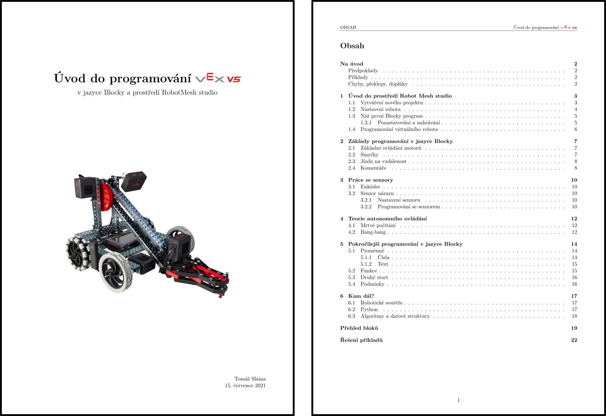

# Úvod do programování VEX V5
Zdrojový kód (a nejaktuálnější verze) učebnice „Úvod do programování VEX V5“ a doplňujícího textu „Metodika k programování VEX V5“



## Kompilování
K vysázení dokumentů použijte
```
latexmk -pdf -outdir=Build/ -shell-escape -pdflatex=lualatex main.tex methodology.tex
```

## Chyby, překlepy, doplňky
Pokud někde odhalíte chybu/překlep, nebo máte pocit, že by něco šlo napsat lépe, tak neváhejte vytvořit issue/pull request, za oboje budu velice rád.

## Větev `msmt`
Ve větvi `msmt` je verze učebnice a doplňujícího textu, která byla odevzdána MŠMT.
Obsahuje řadu úprav, se kterými nesouhlasím (především nezalamování slov), ale jsou pro vydání nezbytné.
